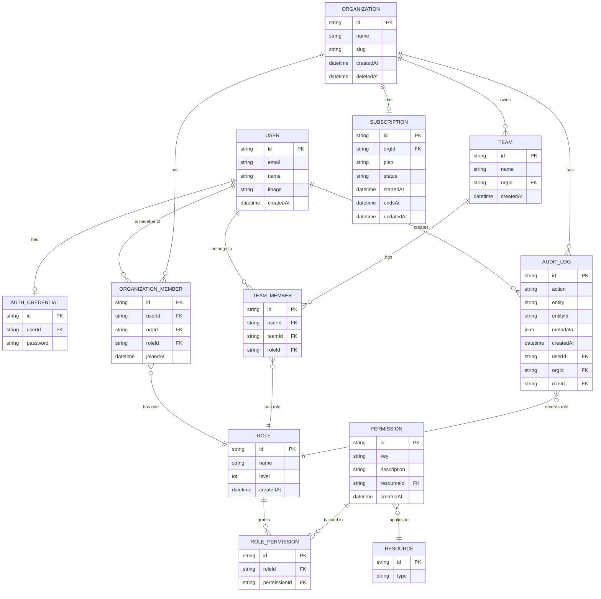

# 📘 B2B SaaS Admin Portal — Database & ERD Documentation

> เอกสารนี้ใช้เป็นบันทึกความเข้าใจ (living doc) สำหรับกลับมาอ่านภายหลังเกี่ยวกับโครงสร้างฐานข้อมูล, RBAC และความสัมพันธ์ของระบบ

---

## 1) เป้าหมายของระบบ (Purpose)
ระบบนี้ถูกออกแบบสำหรับ **B2B SaaS Admin Portal** โดยมีหลักคิดสำคัญคือ:

- รองรับหลายองค์กร (Multi-tenant)
- มีบทบาทและสิทธิ์แบบละเอียด (RBAC: Role-Based Access Control)
- รองรับทีม (Team) ภายในองค์กร
- มี Audit Log สำหรับติดตามการกระทำ
- รองรับระบบ Subscription (แผนการใช้งาน)
- แยกข้อมูลบัญชีผู้ใช้ (User) กับข้อมูลรหัสผ่าน (AuthCredential)

---

## 2) ภาพรวมสถาปัตยกรรมข้อมูล (High-level View)

```
User ──1:1── AuthCredential

User ──1:*── OrganizationMember ──*:1── Organization
Organization ──1:*── Team
User ──1:*── TeamMember ──*:1── Team

OrganizationMember ──*:1── Role
TeamMember ──*:1── Role

Role ──1:*── RolePermission ──*:1── Permission ──*:1── Resource

User ──1:*── AuditLog ──*:1── Organization
AuditLog ──*:1── Role

Organization ──1:1── Subscription
```

---

## 3) Mermaid ERD (สำหรับวาดไดอะแกรม)



---

## 4) คำอธิบายแต่ละ Entity (สรุปสั้น ๆ)

### **User (ผู้ใช้หลัก)**
- เป็นบัญชีผู้ใช้กลางของระบบ
- 1 User มีได้ 1 AuthCredential (แยกรหัสผ่านออกไป)
- 1 User สามารถอยู่หลาย Organization และหลาย Team

### **AuthCredential (ข้อมูลยืนยันตัวตน)**
- เก็บเฉพาะ `password` (ควรเป็น hashed)
- แยกออกจาก User เพื่อความปลอดภัยและความยืดหยุ่น

### **Organization (องค์กร / Tenant)**
- แต่ละองค์กรคือ tenant แยกกัน
- มีสมาชิก (OrganizationMember)
- มีทีม (Team)
- มี Subscription 1 แผน
- มี AuditLog ของตัวเอง

### **OrganizationMember (สมาชิกองค์กร)**
- ตารางกลาง (join table) ระหว่าง User กับ Organization
- มี role (OWNER, ADMIN, MEMBER)
- บังคับว่า 1 user อยู่ใน 1 org ได้ครั้งเดียว (`@@unique(userId, orgId)`)

### **Team (ทีมภายในองค์กร)**
- อยู่ภายใต้ 1 Organization
- มี TeamMember หลายคน
- ชื่อทีมต้องไม่ซ้ำภายในองค์กร (`@@unique(orgId, name)`)

### **TeamMember (สมาชิกทีม)**
- ตารางกลางระหว่าง User กับ Team
- มี role (ผูกกับ Role model เดียวกับระดับองค์กร)

### **Role (บทบาท)**
- เช่น OWNER, ADMIN, MEMBER
- มี `level` สำหรับเปรียบเทียบความสูงของสิทธิ์
- ผูกกับ Permission ผ่าน RolePermission

### **Permission (สิทธิ์ละเอียด)**
- ใช้ key เช่น `users:read`, `invoices:write`
- ผูกกับ Resource เพื่อบอกว่าเป็นสิทธิ์ของอะไร

### **Resource (ทรัพยากร)**
- เช่น `user`, `team`, `invoice`, `organization`
- ช่วยจัดหมวดหมู่ Permission

### **RolePermission (RBAC core)**
- ตารางกลางระหว่าง Role และ Permission
- บังคับไม่ให้ซ้ำ (`@@unique(roleId, permissionId)`)

### **AuditLog (บันทึกกิจกรรม)**
- เก็บทุก action สำคัญในระบบ
- ระบุว่าใคร (userId), ทำอะไร (action), กับอะไร (entity + entityId), ในองค์กรไหน (orgId), ใช้ role อะไร

### **Subscription (แผนใช้งาน)**
- ผูก 1:1 กับ Organization
- มี plan (FREE, PRO, ENTERPRISE)
- มีสถานะ (ACTIVE, CANCELED, PAST_DUE)
- เก็บเวลาที่เริ่มและสิ้นสุด

---

## 5) แนวทางใช้งานในโค้ด (สรุปสั้น)

### การเช็กสิทธิ์ (RBAC flow)
1. ดึง role ของ user ในองค์กร
2. ดึง permissions ของ role นั้น
3. เทียบ `permission.key` กับสิ่งที่ต้องการทำ

ตัวอย่าง (pseudo-code):
```ts
const hasPermission = async (userId, orgId, key) => {
  const member = await prisma.organizationMember.findUnique({
    where: { userId_orgId: { userId, orgId } },
    include: {
      role: {
        include: { permissions: { include: { permission: true } } }
      }
    }
  })

  return member?.role.permissions.some(p => p.permission.key === key)
}
```

---
## 6) สิ่งที่ต่อยอดได้ในอนาคต
- Invite link สำหรับเชิญสมาชิกองค์กร
- SSO (Google, GitHub)
- Billing + Webhook จาก Stripe
- Feature flag ต่อ plan (FREE/PRO/ENTERPRISE)
- Activity feed ต่อองค์กร
- Soft delete + restore สำหรับ Organization

---
> เอกสารนี้สามารถปรับปรุงเพิ่มเติมได้เรื่อย ๆ ตามการพัฒนาระบบ 🚀

